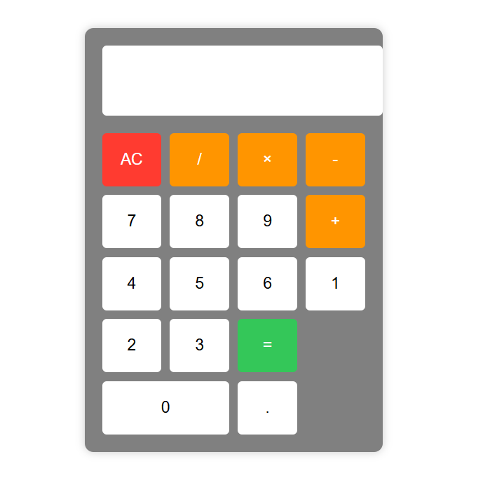

# FOC-assignment-1
# 🧮 Simple Calculator Web App

## **📌 Overview**  
This project is a fully functional calculator that performs basic arithmetic operations (addition, subtraction, multiplication, division) with a clean, modern UI.  

✨ Features:
✔️ Responsive design  
✔️ Error handling  
✔️ Decimal support  
✔️ Keyboard-friendly (optional enhancement)  
✔️ Smooth animations  

---

🛠️ Tech Stack
Tech	         Purpose
 HTML5	         Structure
 CSS3	         Styling
 JavaScript	     Logic

---

## **🚀 Quick Start**  
1. **Clone the repo**  
      sh
   git clone https://github.com/your-username/simple-calculator.git
2. **Open `index.html`**  
   ```sh
   open index.html  # (or double-click the file)
   ```
3. **Start calculating!** 
    ➕➖✖️➗  

---

## **🎨 UI Preview**  
 


---

## **🔧 Functionality**  

| **Button** | **Action** |  
|------------|-----------|  
| `0-9` | Input numbers |  
| `+ - * /` | Basic operations |  
| `.` | Decimal point |  
| `=` | Compute result |  
| `AC` | Clear display |  

---

## **📝 Code Structure**  
```
📂 simple-calculator/
├── 📄 index.html       # Main HTML structure
├── 📄 styles.css       # Styling & animations
└── 📄 script.js        # Calculator logic
```

---

## **💡 Possible Enhancements**  
🔹 **Keyboard support** (e.g., typing `5+3=` computes `8`)  
🔹 **Scientific functions** (sin, cos, log)  
🔹 **Dark mode toggle** 🌙  
🔹 **History tracker** (previous calculations)  

---

## **🙏 Credits**  
Built with ❤️ by **[ Prathyush R Nair ]**  

---

## **📜 License**  
This project is **MIT Licensed** – free to use and modify!  

 ⬇️ ⬇️ ⬇️ ⬇️
[MIT LICENSE](https://opensource.org/license/MIT)

---

**🎉 Happy Calculating!** 🧮✨  


---

### **🔗 Live Demo**  
👉 [Try it here!](#) 

--- 


